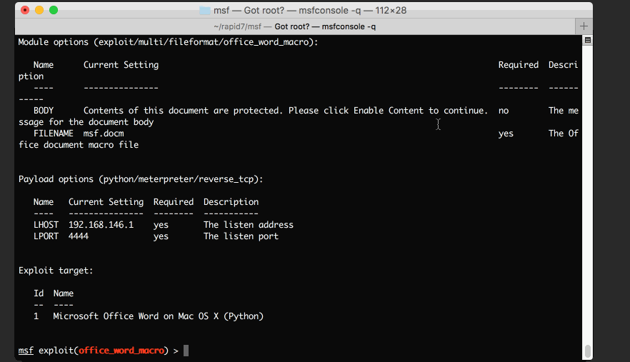
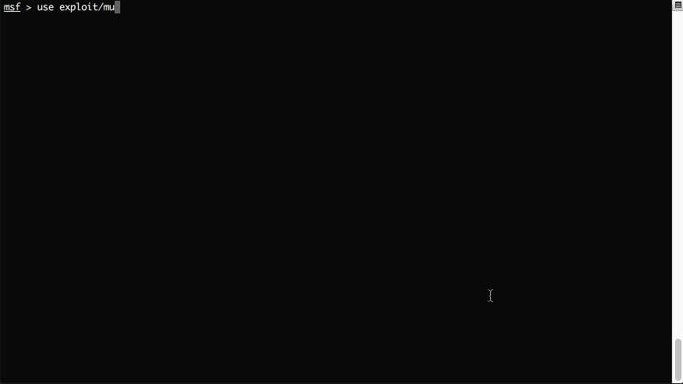

# Attacking Microsoft Office & OpenOffice with Metasploit Macro Exploits

* This was written in May 8 2017 by Wei Chen (_sinn3r)
* Originally published [here](https://www.rapid7.com/blog/post/2017/03/08/attacking-microsoft-office-openoffice-with-metasploit-macro-exploits/)

## Introduction

It is fair to say that Microsoft Office and OpenOffice are some of the most popular applications in the world. We use them for writing papers, making slides for presentations, analyzing sales or financial data, and more. This software is so important to businesses that, even in developing countries, workers that are proficient in an Office suite can make a decent living based on this skill alone.

Unfortunately, high popularity for software also means more high-value targets in the eyes of an attacker, and malware-infested Office macros are like an irritating rash that doesn't go away for IT professionals.

A macro is a feature that allows users to create automated processes inside of a document used by software like Microsoft Word, Excel, or PowerPoint. This is used to enhance user experience, increase productivity, or automate otherwise manual tasks. But, in other words, it executes code. What kind of code? Well, pretty much whatever you want, even a Meterpreter session!

Macro attacks are nothing new or unusual. A typical attack usually involves embedding malicious macro code in an Office document, sending it to the victim, and asking him or her *very nicely* to enable that code. The saddest part isn't how lame the attack is, since you are basically begging the victim to run your malware. It's that people have been falling for this trick for decades!

The impact of such attacks should not be underestimated. In fact, malicious macros are often used in [ransomware](https://www.rapid7.com/fundamentals/what-is-ransomware/), and other high-profile breaches. For example, the Cerber Ransomware was a macro attack against Office 365 that put millions of users at risk. Since Office 365 is extremely popular in businesses, we expect it to be one of malicious macros' favorite audiences for quite some time.

Yup, I think people call that [social-engineering](https://en.wikipedia.org/wiki/Social_engineering_(security)), and apparently it always works. I figured: "ok, why not, a shell is a shell. Let me write some exploits for these"... and that's how Metasploit's macro exploits were born:

## The Microsoft Office Macro Exploit

This Microsoft Office macro exploit is specifically written for the Word document format. It has been tested against these environments:

- Microsoft Office 2010 for Windows
- Microsoft Office 2013 for Windows
- Microsoft Office 2016 for Windows
- Microsoft Office Word for Mac OS X 2011

The following demonstrates how to create a macro exploit for Microsoft Office for OS X, setting up a handler, as well as obtaining a session:

If you actually have a valid certificate to sign the malicious macro, you can actually apply that by using Microsoft Office to sign it. Having a valid cert will not have the "Enable Content" prompt, Microsoft Office will just execute your code by default. However, this is obviously only ideal for internal use. Good certificates are expensive.

## The OpenOffice Macro Exploit

The Apache OpenOffice macro exploit is specifically written for OpenOffice Writer (odt). It has been tested against these environments:

- Windows with Powershell support (which should be the case since Windows 7)
- Ubuntu Linux (which ships LibreOffice by default)
- OS X

Unlike Microsoft, OpenOffice actually does not want to open any documents with macros, which means in order to attack, the victim has to manually do the following in advance:

1. Choose Tools -> Options -> Security
2. Click the Macro Security button
3. Change the security level to either medium to low.

If the security level is set to medium, a prompt is presented to the user to either allow or disallow the macro. If set to low, the macro will run without warning.

Now let's talk about how to use the exploit. The design for it is actually different than the Microsoft one: not only will it create the malicious document file, the module will also spawn a web server, and a payload handler. The purpose of the web server is when the victim runs the macro, the malicious code will download the final payload from our web server, and execute it. The following demonstrates how to use the exploit:

## Exploit Customization

Although the Metasploit macro exploits work right out of the box, some cosmetic customizations are probably necessary to make the document look more legit and believable.

To do this, you will need a copy of either Microsoft Office or OpenOffice (depending on the type of exploit you're using), and then:

1. Generate the exploit
2. Move the exploit to a platform with Office that can edit the document
3. Open the document with Office, do your editing there. When you're done, simply click save. As long as you're not modifying the macro, it should still work

## Time to Play!

Congratulations, young grasshopper! If you've read this far, and have not fallen asleep, then you are ready to start your journey of sweet Office macro pwnage. But before you leave, if you have never used Metasploit - a cyber weapon forged in the fires of um... Austin, Texas - then you shall download it [here](https://www.rapid7.com/products/metasploit/download/). If you already possess such power, then we strongly recommend you run msfupdate.

Go now, embrace your destiny of pwnage, and let that glory be yours with Metasploit Office macro exploits.
