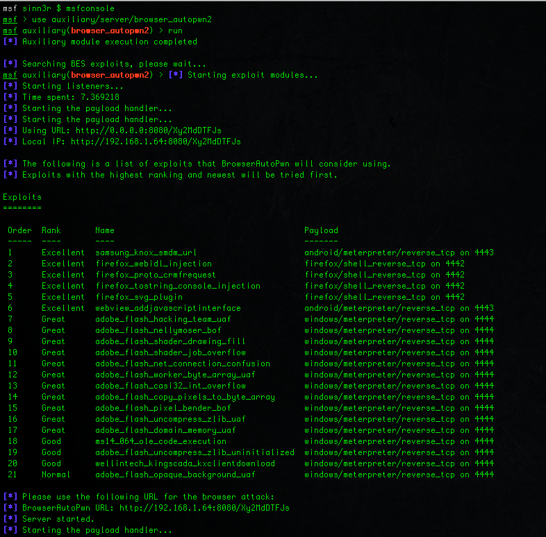

# The New Metasploit Browser Autopwn: Strikes Faster and Smarter - Part 1

* This was written in July 15 2015 by Wei Chen (_sinn3r)
* Originally published [here](https://www.rapid7.com/blog/post/2015/07/15/the-new-metasploit-browser-autopwn-strikes-faster-and-smarter-part-1/)

## Introduction

Hi everyone,

Today, I'd like to debut a completely rewritten new cool toy for Metasploit: **Browser Autopwn 2**. Browser Autopwn is the easiest and quickest way to explicitly test browser vulnerabilities without having the user to painfully learn everything there is about each exploit and the remote target before deployment. In this blog post, I will provide an introduction on the tool. And then in my next one, I will explain how you can take advantage of it to maximize your vuln validation or penetration testing results.

## The Origin of Browser Autopwn

Before we begin, allow me to talk about why we decided to recreate it. Originally, Browser Autopwn was written by our developer [Egyp7](https://twitter.com/egyp7) back in 2008. It all started off with how Egyp7 saw people were using browser exploits the wrong way. Typically, users would fire off one exploit at a time to do a real attack, but you shouldn't do that because in reality you'd probably run into users with different browsers on different platforms. If the only exploit you're using ends up being loaded by the wrong version of browser, your attack could be spoiled. What you need is some type of custom web server that automatically detects what the connected client is using, what platform it's on, and then serve the exploits accordingly. Or as Egyp7 put it: "you need the guided missile approach."

In 2009, the first Browser Autopwn was [presented at Defcon 17](https://www.youtube.com/watch?v=aNsU1hg_xkQ).

## The brain behind the new BAP: BrowserExploitServer

In 2013, I wanted to take this design even further and began some big changes. First off, I created the [BrowserExploitServer](https://github.com/rapid7/metasploit-framework/wiki/How-to-write-a-browser-exploit-using-BrowserExploitServer) mixin (or BES for short). Instead of having information gathering exclusive in Browser Autopwn, a standalone BES-powered browser exploit will always enforce it in order to avoid user errors. We also added some decent support for multi-platform plugin detections.

Exploit writers are also required to always specify exploitable requirements, such as the browser version (down to the build number when possible), platforms, plugin version, etc. The final result of doing all this allows a BES module to be smarter all the time: if you serve the exploit to a target that isn't exploitable or suitable, the module will figure this out on its own and refuse to attack.

## Browser Autopwn 2

In 2015, I started rewriting Browser Autopwn. The new one relies on BES to gather browser information, and then it can share that info with the exploits it manages so they don't have to do it again. Some notable features include:

### Speed

Since BAP2 doesn't need to worry about information gathering, I was able to spend more time on performance, module management and some visual experience. For performance, you will see a major boost compare to the old one. In my testing (2.7 GHz i7, 16GB DDR3, SSD, Ruby 2.1), the old one takes about 3 minutes to load and be ready. The new one is roughly 6 to 7 seconds. Exactly how fast your BAPv2 can get going also depends on your hardware, but this should give you an idea how fast it is now.

### Better Module Management

I also took a very different approach with module management. Instead of manually maintaining a list of exploits to use for Browser Autopwn, there is no maintenance required. What BAP2 does is it will go through the entire exploit module tree, find all the ones powered by BrowserExploitServer, and then sort them based on the module ranking and disclosure date. In other words, the highest ranking and the newer exploits will be tried first. By default, 21 exploits are loaded, and this is user-configurable.

When a browser is connected to the Browser Autopwn server, obviously not all those 21 exploits will be served. Browser Autopwn will do an exploitable requirement check to find the ones suitable, and then give the browser a list of exploit URLs to try. Since these are sorted by ranking and date, the new Browser Autopwn has a much better first shot accuracy than before, so it pwns faster.

### Exploit Content

Obviously, having good exploits is also an important part for the whole delivery system. You will see that out of the default 21, most of them are: Excellent, Great, and Good rankings around Android, Firefox, and Adobe Flash. And this default list will also tend to reflect what kind of exploits people are seeing in the wild. For example, this year we have seen a higher number of Adobe Flash attacks, you will see this pattern too with BAP2.

If you'd like read about our coverage on recent Adobe Flash, make sure to checkout More Flash Exploits in Framework written by our developer [Juan Vazquez](https://twitter.com/_juan_vazquez_).

### Visual Experience

The new Browser Autopwn 2 also gets a different looking interface. The goal is not to overload the user with information, so it uses a Rex table to tell you what exploits will be used and what payloads they will be using. As an user, this is pretty much all you care really. And then of course, at the bottom it tells you which URL to use for the attack.

Here's the new look of Browser Autopwn 2:

If you'd like to try, BAP2 is now available upstream in the Metasploit Framework. Make sure to run msfupdate and you should have it. If you are a Pro or Kali user, you will soon have BAP2 in the upcoming update.

And finally, I'd like to thank these people for making BAPv2 even better and smarter: [HD Moore](https://twitter.com/hdmoore), [Juan Vazquez](https://twitter.com/_juan_vazquez_), [James Lee](https://twitter.com/egyp7), [void-in](https://twitter.com/voidin), and [mr_me](https://twitter.com/ae0n_).

For the next blog, I will talk about things like how to limit the scope of your attack (so it won't go wild like crazy and you hit the wrong people), how to test a specific browser, how to rick-roll and still collect exploitable information, etc. It will be fun. Stay tuned.

If you'd like learn about all the fun tricks you can do with Browser Autopwn 2, [please read the next blog post](https://www.rapid7.com/blog/post/2015/07/16/the-new-metasploit-browser-autopwn-strikes-faster-and-smarter-part-2/).