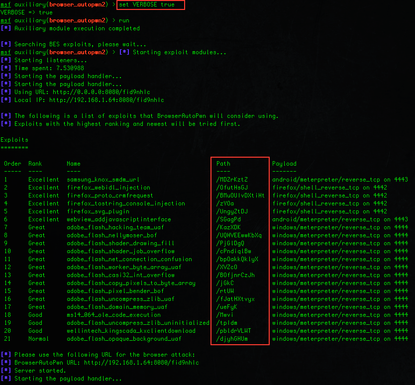
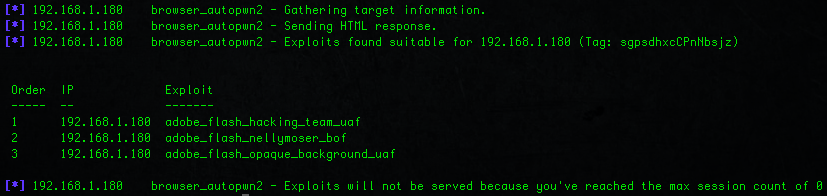
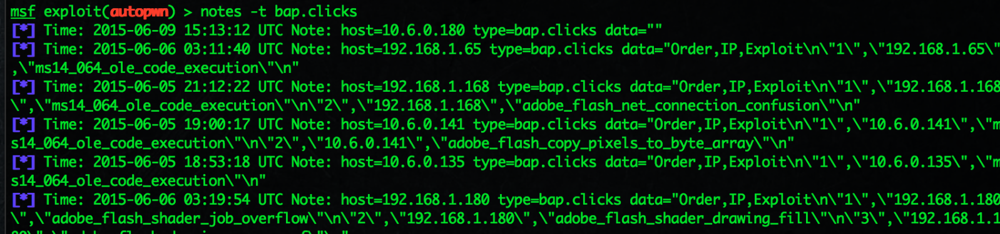

# The New Metasploit Browser Autopwn: Strikes Faster and Smarter P2

* This was published in July 16 2015 by Wei Chen (_sinn3r)
* Originally published [here](https://www.rapid7.com/blog/post/2015/07/16/the-new-metasploit-browser-autopwn-strikes-faster-and-smarter-part-2/)

## Introduction

Hello again,

Welcome back! So yesterday we did an introduction about the brand new Browser Autopwn 2, if you have not read that, make sure to [check it out](https://www.rapid7.com/blog/post/2015/07/15/the-new-metasploit-browser-autopwn-strikes-faster-and-smarter-part-1/). And today, let's talk about how to use it, what you can do with it for better vulnerability validation and penetration testing.

As we explained in the previous blog post, Browser Autopwn 2 is a complete redesign from the first one so quite a few things will look and feel different for you. Here are the things you should know before using:

## Exploit URLs

First off, there is only URL you need to care about, and that's the BrowserAutoPwn URL in green (or yellow if you're on Pro). If you need to see each exploit's URL, you need to do set VERBOSE true, and there will be another column for it like the following example:



The verbose option will also print more things when Browser Autopwn is in action. Hey, you asked for it :-)

## Browser Autopwn Options

If you do "show options" or "show advanced" in msfconsole, you will see that Browser Autopwn 2 has these special options that other typical HttpServer modules don't have:

**The** **HTMLContent** **option**

The HTMLContent option allows you to serve a basic HTML web page to the browser instead of having a blank one. It supports two syntaxes:

```
set HTMLContent Hello world!  
```

The above example will basically print "Hello world!" on the browser while exploits are tested against it. Here's another one:

```
set HTMLContent file://tmp/hello_world.html  
```

The above example will load file /tmp/hello_world.html and that's what the browser will see. Most likely the second syntax is how you'd want to use the Content option.

Keep in mind that you should probably try to keep HTMLContent as simple as possible, otherwise there is a possibility that it might actually influence the reliability of the exploits, especially the ones that do memory corruption.

**The** **EXCLUDE_PATTERN** **option**

The EXCLUDE_PATTERN option is used for excluding exploit file names you don't want Browser Autopwn 2 to use. This is a regex type option, you can be creative about this. For example, Adobe Flash exploits in Metasploit tend to have the same file name that begins with: adobe_flash_, so to exclude those, you can do:

```
set EXCLUDE_PATTERN adobe_flash  
```

**The** **INCLUDE_PATTERN** **option**

The INCLUDE_PATTERN option is for loading specific exploits that you want Browser Autopwn 2 to use. Let's reuse the Adobe Flash file name example, if you only want Flash exploits, you can do:

```
set INCLUDE_PATTERN adobe_flash  
```

If you set both INCLUDE_PATTERN and EXCLUDE_PATTERN, the evaluation for INCLUDE_PATTERN will kick in first, followed by EXCLUDE_PATTERN.

**The** **MaxExploitCount** **option**

The MaxExploitCount option is for specifying how many exploits you want Browser Autopwn 2 to load. By default, it's 21. But you can try to bump it up a little bit if you wish to try more exploits. Note that by doing so you are also allowing more lower ranking modules to kick in, you will have to figure out the sweet spot for it. An example of setting it:

```
set MaxExploitCount 30   
```

**The** **MaxSessionCount** **option**

The MaxSessionCount option is for limiting how many sessions to get. It may sound a little odd at first because why would you want to do that, right? Well, a use case for this is when you don't actually want to pop shells, instead you just want to know what exploits could be used, this is something you can try. You can also use this if you don't want your attack to stay open the whole time:

```
set MaxSessionCount 10  
```

**The** **ShowExploitList** **option**

The ShowExploitList option means displaying a list of exploits specific to each browser/client. As we've explained before, when BAP2 loads 21 exploits, probably not all 21 will be served to the browser, only some of them. In order to see those ones, you need to set this option:

```
set ShowExploitList true  
```

**The** **AllowedAddresses** **option**

The AllowedAddresses option is for attacking a specific range of IPs as a way to avoid penetration testing accidents. For example, when you send a malicious link to a specific person, that person may actually share it with his friends, family or other people, and those people aren't your targets so you shouldn't hit them. Well, Browser Autopwn doesn't know that, so one of the ways to avoid that is to create a whitelist.

The option also supports two syntaxes. This is most likely how you will set it:

```
set AllowedAddresses file://tmp/ip_list.txt  
```

The above will load file ip_list.txt. In that file, one IP per line.

**The ExploitReloadTimeout option**

The ExploitReloadTimeout is for setting how long BAP2 should wait before loading the next exploit. By default, it's 3 seconds, but in case some exploits need more time (for example, longer time to groom the heap, load other things, or it's doing a sleep somewhere), you will need to set this. In most cases, you shouldn't have to.

Here's an example of setting it to 5 seconds:

```
set ExploitReloadTimeout 5000  
```

## Application-Specific Testing

By default, Browser Autopwn 2 goes through the entire exploit module tree, and will try to use different types of exploits - Firefox, Internet Explorer, Adobe Flash, Android, etc. If you want to test a specific application, basically all you need to do is setting the INCLUDE_PATTERN option (or maybe EXCLUDE_PATTERN).

However, there is another trick to make this task even easier. BAP2 also comes with the following resource scripts that can automatically do this:

- bap_firefox_only.rc - For testing Firefox
- bap_flash_only.rc - Fore testing Adobe Flash
- bap_ie_only.rc - For testing Internet Explorer

Here's an example of using bap_flash_only.rc to test Adobe Flash vulnerabilities:

```
$ ./msfconsole -q -r scripts/resource/bap_flash_only.rc  
```

## Rick-Rolling

So one of the use cases we've heard from people who do phishing or social engineering attacks is that they don't necessarily use exploits, they might trick people into clicking on a "malicious" link, and that takes the user to a security training website or whatever. But while doing this it would be nice to know what exploits could be used against each user, wouldn't it? With the new Browser Autopwn, you can do all this.

The solution for that is this new resource script: bap_dryrun_only.rc. It does a few things for you:

- It sets the ShowExploitList option to true
- It sets the MaxSessionCount option to 0
- It sets the Custom404 option to https://www.youtube.com/watch?v=dQw4w9WgXcQ

Here's an example of how it runs:


Now, if I serve the BrowserAutoPwn URL to the client, they will see the rick-rolling video, which I'm sure will drive them crazy. And guess what? Rick Astley will never gonna give you up!


On the attacker's side, you've already collected information about which browser exploits this user is possibly vulnerable to. Pretty nice, yeah?



## Logging

In addition, when a browser connects to BAP, this link-clicking event is also logged to the database as a "bap.clicks" note type. If the ShowExploitList option is set to true, that will also save the exploit list information so that after testing you can go back to the database and see which users are vulnerable to what exploits.

Even if you don't set the ShowExploitList option, the logged link-clicking event data is more than enough to prove that the user was social-engineered, which is still a security risk.

To see all the bap.clicks events, in msfconsole do:

```
notes -t bap.clicks 
```

And here's an example of the list:



From there, you can do additional analysis of these notes, put it on your report, and hopefully do something about it.

And that's all we have for today! I hope you like what you see :-)

Browser Autopwn 2 is Metasploit's new shiny weapon that reflects how hackers today carry out browser attacks against real targets, from amateur level to APT ([Advanced Persistent Threat](https://en.wikipedia.org/wiki/Advanced_persistent_threat)), which ultimately affects every user on the Internet both personally and financially. If you would like to give Browser Autopwn 2 a try to see how you can defend against it, it is now available in upstream master. As a framework user, you can get this by running the msfupdate utility. If you are a Metasploit Pro or Kali user, please keep an eye on the upcoming update. Any bug reports or feature requests, please submit them to [Metasploit's Github repository](https://github.com/rapid7/metasploit-framework/issues). Any questions, please feel free to start a discussion on [the Rapid7 Community](https://docs.rapid7.com/). Or if you will be at [Defcon 23](https://www.defcon.org/), come by and say hi and let us know what you think how the future of Browser Autopwn should be :-)
